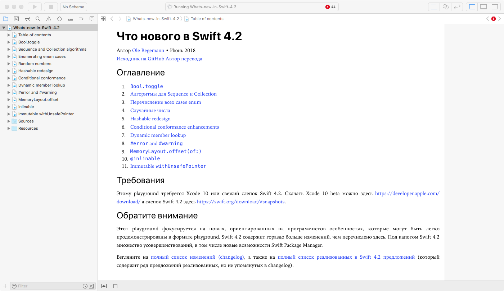

# What’s new in Swift 4.2

Playground для Xcode, демонстрирующий новые особенности Swift 4.2.

Автор [Ole Begemann](https://oleb.net), Июнь 2018.
Перевод [Laconic](https://laconic.website)

Этому playground требуется Swift 4.2. Xcode 10 включает Swift 4.2 по-умолчанию. [Скачать Xcode 10 beta ](https://developer.apple.com/download/).

Также можно запустить playground в Xcode 9.4, но тогда нужно установить[свежий слепок Swift 4.2 с swift.org](https://swift.org/download/#snapshots) (не волнуйтесь, это легко).

Взгляните также на:  [What’s new in Swift 4.0 playground](https://github.com/ole/whats-new-in-swift-4) из 2017.

